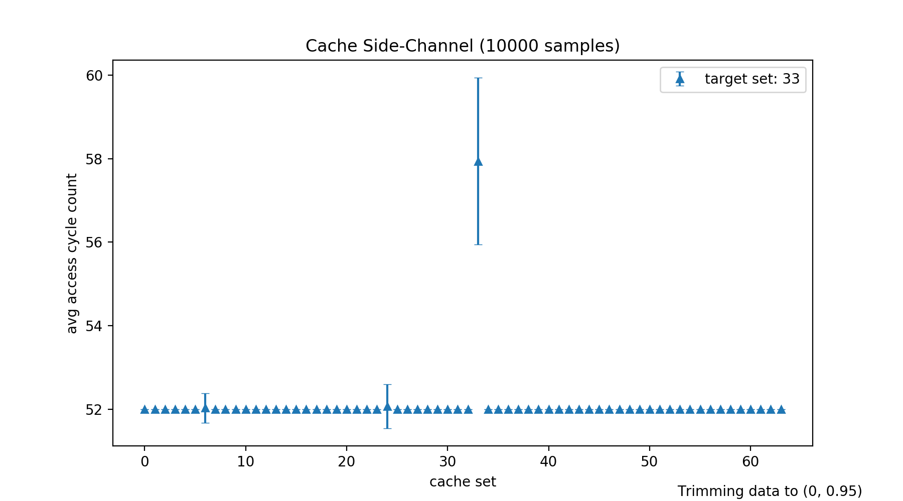
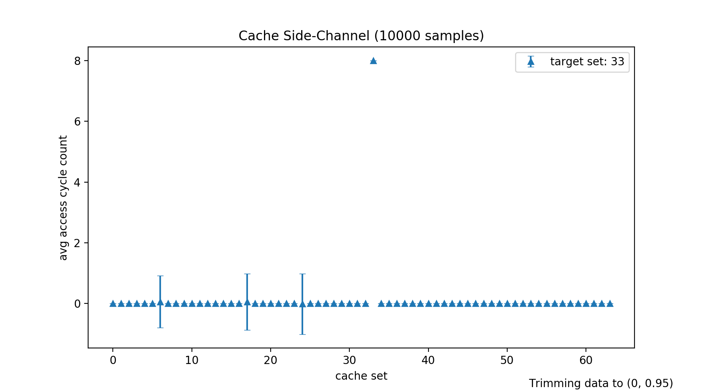
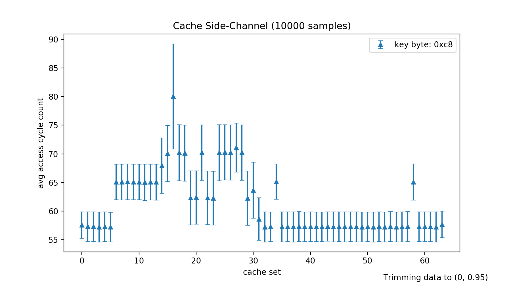
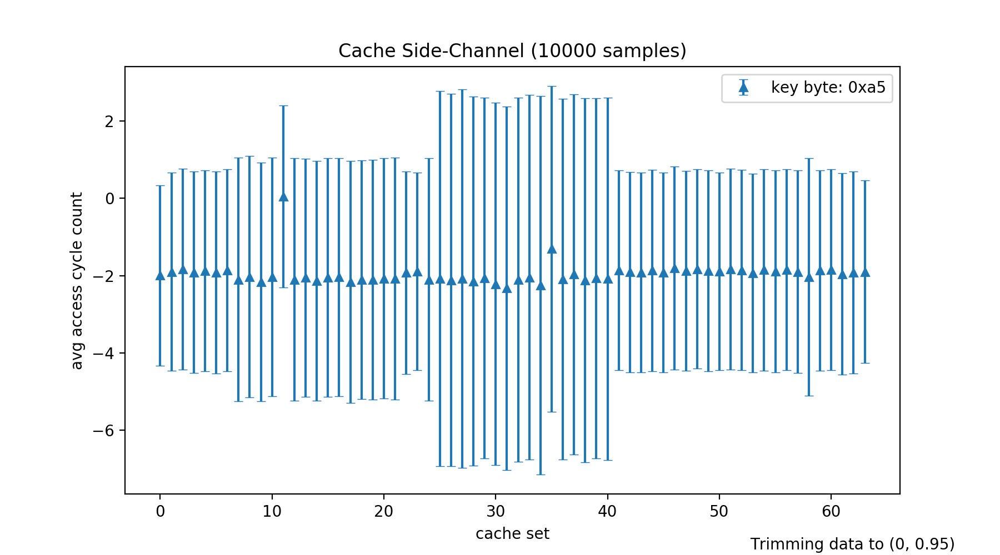

# CacheSC
CacheSC is a library for L1 and L2 cache side-channel attacks. It implements `Prime+Probe` attacks on contemporary hardware. It features:
- Simple interface to abstract low-level complications of performing cache attacks, including precise time measurements in the presence of out-of-order execution.
- Privileged and unprivileged methods to attack physically indexed caches (such as L2 on many devices).
- Handy plotting scripts to visualise side-channel oberservations.

This code was developed and tested on a Dell Latitude E6430 with Ivy Bridge processors (Intel(R) Core(TM) i7-3520M CPU @ 2.90GHz) running Ubuntu 18.04. Since cache side-channels are highly architecture-dependent, the library might require some adaptions for other hardware. However, we expect the basic concepts and underlying problems to be present on other architectures due to its fundamental trade-off with performance.

This library was developed in the context of a student project at the LASEC departement of EPFL. The rationale behind the design of this library, in-depth discussion of the demo applications and cache side-channels in general can be found in our [report](./docs/revisiting-microarchitectural-side-channels-Miro-Haller.pdf).

Abstract:
> Microarchitectural side-channels exploit observations on the internal state of (cryptographic) algorithms obtained by measuring side-effects such as contention on a shared resource. In this project, we focus on cache side-channels, which were among the first practically exploited information leakages. We provide an overview of the extensive research on cache timing attacks and a more in-depth analysis of the wide-spread Prime+Probe technique. We find that due to the empirical approach on cache side-channels, the results are often tailored to specific software and hardware versions. However, we consider it beneficial to revisit cache attacks and adapt them to new environments as the side-channels’ underlying root causes are likely to persist over time and architectures because of their fundamental relation to performance. Therefore, we revisit a classical chosen-plaintext attack, targeting OpenSSL’s AES-CBC implementation, and apply it on contemporary hardware. We explain the challenges of implementing this attack in the presence of out-of-order execution, dynamic frequency scaling, hardware prefetching, line-fill buffers and other optimisations. Furthermore, we especially highlight the importance of an appropriate data structure to cope with the previous challenges while minimising cache side-effects of the measurement itself.
>
> Moreover, we contribute CacheSC, a library that implements different variants of Prime+Probe targeting not only on virtually indexed caches but also including two methods to attack physically indexed caches. The first attack requires superuser privileges and translates virtual to physical addresses in user space by parsing the pagemap file. The second approach uses collision detection to build the cache attack data structure without requiring special privileges. Finally, we use CacheSC to conduct an initial review of the AES key scheduling algorithm as well as Argon2 and provide starting points for novel applications of cache side-channels.

I would like to thank Muhammed Fatih Balli for supervising this project and many productive discussions and good inputs. Moreover, I would like to thank Prof. Serge Vaudenay for making this project possible.


## 1 Installation
### 1.1 Prerequisits
Basic utilities required for compiling the library and using the Python plotting scripts.
```text
$ sudo apt-get install git build-essential gcc python3 python3-pip
```

### 1.2 Install Library
Clone the repository:
```text
$ git clone git@github.com:Miro-H/CacheSC.git
```

**Before you compile the library, configure your device specific hardware parameters.** It is essential for the cache attacks that you enter the correct cache dimensions (and other constants) in `./src/device_conf.h`. Useful commands to gather this information are `x86info -c`, `cat /proc/cpuinfo`, `lscpu`, and `getconf -a | grep CACHE`.

Compile the library and demo code:
```text
$ cd CacheSC
$ make
```

This will produce `libcachesc.a` in `./lib` and the available header files in `./include`. Link this library in your C files as usual (see demo files). To use a custom installation path, run:
```text
$ INST_PATH=/your/custom/installation/path make
```

### 1.3 Install Python Packages for Plotting
In case you want to use the plotting scripts, you need to install the Python packages.
```text
$ pip3 install -r install/pip_requirements.txt
```
In case new package updates cause problems, the last version of the packages with which the library was tested can be installed by using `install/pip_requirements_exact.txt`.

## 2 Demo
The folder `./demo` contains some example uses of the CacheSC library.

### 2.1 Single Eviction
In this scenario, we show case the library by measuring a single cache line access, i.e. the scenario is:
```text
for #samples do
    prime
    access cache line
    probe
```

Compile this demonstration attack by running the following command inside the `./demo` folder:
```text
$ make single-eviction
```

Run the demonstration code and store its output in a log file:
```text
$ ./demo/single-eviction 10000 > /tmp/attack.log
```
This performs `10000` Prime+Probe measurements.

Plot the results:
```text
$ ./scripts/plot-log.py -o /tmp -v -t /tmp/attack.log
```

Expected result:


For many attacks, it is advantageous to normalize the measurements, e.g. to filter secret-independent cache accesses. The following commands run the same test with normalization and plots the normalized results:
```text
$ cd ./demo
$ NORMALIZE=1 make rebuild
$ cd ..
$ ./demo/single-eviction 10000 > /tmp/attack.log
$ ./scripts/plot-log.py -o /tmp/cachesc -v -t -n /tmp/attack.log
```

Expected normalized result:


This demo attack can also be run on physically indexed caches (such as L2). For this purpose, uncomment the following three macros in `single-eviction.c`, and comment out the definitions for L1.
```C
// Uncomment for L2 attack
#define TARGET_CACHE L2
#define MSRMTS_PER_SAMPLE L2_SETS
#define PRIME prime_rev
```

There is a priviliged and unprivileged version of this attack on physically indexed caches. The library will choose itself, based on the available privileges. The privileged version is significantly faster, building the data structure without privileges can require several minutes.

### 2.2 Chosen-Plaintext Attack on OpenSSL AES-CBC
This attack uses CacheSC to implement the classic chosen-plaintext attack, similar to the one-round attack from Osvik, Shamir, and Tromer (presented in Cache Attacks and Countermeasures: the Case of AES), to recover half of any key byte of the AES-CBC encryption. However, instead of Evict+Time we use Prime+Probe for this attack. Our [report](./docs/revisiting-microarchitectural-side-channels-Miro-Haller.pdf) provides an in-depth discussion of this attack.

Compile the attack by running the following in `./demo`:
```text
$ OPENSSL_INCL=/path/to/openssl/include OPENSSL_LIB=/path/to/openssl/lib make openssl-aes-cbc
```
Where `OPENSSL_INCL` and `OPENSSL_LIB` point to your local OpenSSL installation. Specifying those environment variables is optional. Their defaults are `/usr/local/include` respectively `/usr/local/lib`.

Note that you have to ensure that the vulnerable AES-CBC implementation of OpenSSL is run, i.e. not hardware optimizations such as `AES-NI` (OpenSSL checks on runtime, if `AES-NI` is available and may use it, unless you deactivate this). We tested this attack on `OpenSSL-0.9.8` (the original version used by Osvik et al.), compiled with the `no-asm` flag.

It is again advisable to normalize the results, i.e. compile with the `NORMALIZE=1` flag.

The expected plots (obtained as in the previous demo example) are:
- Raw: 
- Normalized: 

### 2.3 Argon2d
This is no full attack. It rather provides an entry point for an asynchronous attack which builds on observing cache access patterns of passwords hashed with Argon2d. We argue in our [report](./docs/revisiting-microarchitectural-side-channels-Miro-Haller.pdf) that precise cache side-channel observations on Argon2d could be used for more efficient password cracking, bypassing Argon's parameterizable number of passes through memory.

Compile the attack by running the following in `./demo`:
```text
$ ARGON_INCL=/path/to/argon2/include ARGON_LIB=/path/to/argon2/lib make argon2d-attacker argon2d-victim
```
Where `ARGON_INCL` and `ARGON_LIB` point to the local installation of [Argon2](https://github.com/p-h-c/phc-winner-argon2). Those variables are again optional and default to `/usr/include` respectively `/usr/lib/x86_64-linux-gnu`.

Start the victim and (privileged) attacker using the following commands:
```text
$ sudo ./argon2d-attacker > /tmp/attacker.log &
$ sleep 1
$ ./argon2d-victim 10 > /tmp/victim.log
$ sudo pkill -SIGINT -f argon2d-attacker
```

The accuracy of those observations could be evaluated by patching `Argon2d` (e.g. the `index_alpha` function in `opt.c`) to also print a timestamp and then observe how many blocks are processed between two scheduling periods of the attacker. We discuss the results of such a comparison in our [report](./docs/revisiting-microarchitectural-side-channels-Miro-Haller.pdf).


## 3 Plotting Script Options
```text
$ ./scripts/plot-log.py -h
usage: plot-log.py [-h] [-o OUTPUT_FOLDER] [--ylims YLIMS] [-n] [-t] [-v]
                   log_file

positional arguments:
  log_file              path to log file to parse

optional arguments:
  -h, --help            show this help message and exit
  -o OUTPUT_FOLDER, --output_folder OUTPUT_FOLDER
                        path to folder for the produced plots
  --ylims YLIMS         fix y axis of plot, tuple (y_min, y_max)
  -n, --normalize       normalize samples using an additional data set with
                        uninfluenced data points
  -t, --transpose       transpose data set, i.e. average overthe i-th entries
                        of each sample
  -v, --verbose         print debug output
```
